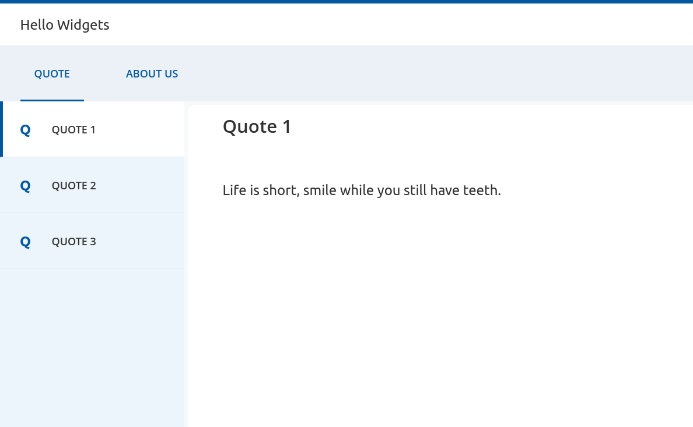

# Quick Start - Widgets Showcase

- Get started

  /
- Quick start

*link*Quick Start

Installation

Setup environment and tools

Install Node.js and npm

In this tutorial we will use **Node.js 24.x** and **npm 11.x**, you can download Node.js (npm is included in Node.js
installer) at: [Node.js.org](https://nodejs.org/en)

To check your Node.js and npm version:

```
1node -v
2# v24.x
3npm -v
4# 11.xcontent_copy
```

You can also use [nvm](https://github.com/creationix/nvm) to install Node.js.

```
1nvm install 24content_copy
```

Install IDE

There are several IDEs you can use to work with React/TypeScript. In this tutorial we will
use [Visual Studio Code](https://code.visualstudio.com/download) (VS Code) because it's a great free code editor.

Hello world project with Widgets

Create a React and TypeScript project

We will use [Vite](https://vite.dev/guide/#scaffolding-your-first-vite-project) to create a sample project which is already configured
with React and TypeScript and ready to run.

Open your terminal and cd to anywhere you want to save the project directory then run this command to create a new project named "hello-widgets":

```
1npm create vite@latest hello-widgets -- --template react-tscontent_copy
```

A new directory will be created which has the same name as the new project, which in this case is **hello-widgets**
directory.

At this point, your project layout should look like the following:

```
hello-widgets/
├─ public/
├─ src/ -> contains our TypeScript and CSS code
│  └─ ...
├─ package.json -> contains our dependencies...
└─ tsconfig.json -> contains TypeScript-specific options for your project

```

To run this project:

```
1cd hello-widgets
2npm run devcontent_copy
```

After that, your browser will open a new tab and you'll see a **Welcome to React** page., you can also do it manually by
opening this address *<http://localhost:5173>*

Install Widgets and required dependencies

Follow these commands to install the Widgets package to your project.

```
1npm install @com.mgmtp.a12.widgets/widgets-corecontent_copy
```

Widgets styling is built with styled-components, so they are needed as well:

```
1npm install styled-components @types/styled-componentscontent_copy
```

You can see these packages already in the **package.json** file:

```
1{
2	"dependencies": {
3		"@com.mgmtp.a12.widgets/widgets-core": "^38.0.0",
4		"react": "^19.x.x",
5		"react-dom": "^19.x.x",
6		"styled-components": "^6.x.x"
7	}
8}content_copy
```

Polyfills

Some of our Widgets' code and dependencies make use of ES2015 language features. We expect your browser supports these
APIs natively or with the assistance of a polyfill.

Use Widgets components

Import directly to the components you need:

```
1import { Button } from "@com.mgmtp.a12.widgets/widgets-core/lib/button";
2import { ButtonGroup } from "@com.mgmtp.a12.widgets/widgets-core/lib/button-group";content_copy
```

There is an example about how to use Widgets button component instead of the normal button tag, modify the **App.tsx**
like this:

```
1import React from "react";
2import "@com.mgmtp.a12.widgets/widgets-core/lib/theme/basic.css";
3import { Button } from "@com.mgmtp.a12.widgets/widgets-core/lib/button";
4
5export default function App() {
6    return <Button label="This is a button from widgets" primary={true} />;
7}
8content_copy
```

Wait a moment then you will see some compilation errors being thrown. This is because Widgets requires a theme to run. To fix
this, adapt the code and add a ThemeProvider, as well as GlobalStyles provided from Widgets:

```
1import React from "react";
2import { ThemeProvider } from "styled-components";
3
4import { GlobalStyles } from "@com.mgmtp.a12.widgets/widgets-core/lib/theme/base";
5import { flatTheme } from "@com.mgmtp.a12.widgets/widgets-core/lib/theme/flat/flat-theme";
6import "@com.mgmtp.a12.widgets/widgets-core/lib/theme/basic.css";
7
8import { Button } from "@com.mgmtp.a12.widgets/widgets-core/lib/button";
9
10export function App() {
11  return (
12    <ThemeProvider theme={flatTheme}>
13        <GlobalStyles />
14        <Button label="This is a button from widgets" primary={true} />
15    </ThemeProvider>
16  );
17}
18content_copy
```

There are many components from simple to complex such as button, icon, textline to tree, table, editor... You can see
more [here](../Widgets/index.md).

Sample application uses Application Frame

Application Frame Widget uses the A12 plasma-design and makes its html and css class-structures transparent to the user,
so the user does not have to deal with it. This layout should be responsive and is mainly focusing on the desktop,
tablet and smartphone devices.

Application Frame with dummy texts

In example below, we will use `ApplicationFrame` widget to show a simple web application with three areas are header (
top), sidebar (left) and content (center).

```
1import React from "react";
2import { ThemeProvider } from "styled-components";
3
4import { GlobalStyles } from "@com.mgmtp.a12.widgets/widgets-core/lib/theme/base";
5import { flatTheme } from "@com.mgmtp.a12.widgets/widgets-core/lib/theme/flat/flat-theme";
6import "@com.mgmtp.a12.widgets/widgets-core/lib/theme/basic.css";
7
8import { ApplicationFrame } from "@com.mgmtp.a12.widgets/widgets-core/lib/layout/application-frame";
9
10export default function App() {
11  return (
12  <ThemeProvider theme={flatTheme}>
13    <GlobalStyles />
14    <ApplicationFrame
15    main={<div>Header</div>}
16    sub={<div>SideBar</div>}
17    content={<div>MainContent</div>}
18    />
19  </ThemeProvider>
20  );
21}
22
23content_copy
```

As you can see, there are three dummy texts which help you determine where it is. In our next example, we will use real
components instead of some dummy texts. Now we will create each component for each area and then reuse it in the
main `App` component step by step.

Implement a header

Let's create a header containing a title and a main menu. Create a new file name **Header.tsx** with below content.

```
hello-widgets/
...
├─ src/
│  ├─ App.tsx
│  └─ Header.tsx
...

```
```
1import React from "react";
2import { ApplicationHeader } from "@com.mgmtp.a12.widgets/widgets-core/lib/application-header";
3import { FlyoutMenu, MenuItem } from "@com.mgmtp.a12.widgets/widgets-core/lib/menu";
4
5export interface HeaderProps {
6  items: MenuItem[];
7}
8
9export function Header(props: HeaderProps): React.ReactElement<HeaderProps> {
10  return (
11	<div>
12	  <ApplicationHeader leftSlots="Hello Widgets" />
13	  <FlyoutMenu type="horizontal" items={props.items} />
14	</div>
15  );
16}
17content_copy
```

1. `ApplicationHeader`: useful for displaying information like application logo, application name, version or user
   information on top of the page.
2. `FlyoutMenu`: vertical/horizontal menu which will show sub-menu items when the mouse's hovering.

In this example, we already create new component name `Header` with the *input* (props) is a list of menu items which
will be shown in the menu. You can read more about these
things [here](https://reactjs.org/docs/components-and-props.html). Basically, a component is just a small piece of UI
which is simple and also reusable.

Implement a sidebar

A sidebar just a vertical flyout menu. Create a new file name **Sidebar.tsx** and copy&paste below content.

```
hello-widgets/
...
├─ src/
│  ├─ App.tsx
│  ├─ Header.tsx
│  └─ Sidebar.tsx
...

```
```
1import React from "react";
2import { FlyoutMenu, MenuItem } from "@com.mgmtp.a12.widgets/widgets-core/lib/menu";
3
4export interface SidebarProps {
5  items: MenuItem[];
6}
7
8export function Sidebar(props: SidebarProps): React.ReactElement<SidebarProps> {
9  return <FlyoutMenu type="vertical" items={props.items} />;
10}
11content_copy
```

Implement a content area

Content area will be a content box which uses `ActionContentbox` component. Create a new file name **Content.tsx** and
copy&paste below content.

```
hello-widgets/
...
├─ src/
│  ├─ App.tsx
│  ├─ Header.tsx
│  ├─ Sidebar.tsx
│  └─ Content.tsx
...

```
```
1import React from "react";
2import { ActionContentbox, ContentBoxElements } from "@com.mgmtp.a12.widgets/widgets-core/lib/contentbox";
3
4export interface ContentProps {
5  title: string;
6  text: string;
7}
8
9export function Content(props: ContentProps): React.ReactElement<ContentProps> {
10  return (
11	<ActionContentbox
12	  headingElements={<ContentBoxElements.Title text={props.title} />}
13	>
14	  {props.text}
15	</ActionContentbox>
16  );
17}
18content_copy
```

Content box widget is used to structure content as well as actions in a consistent way. It also has responsive behavior
on mobile devices.

Use header, sidebar, and content

Just replace the dummy texts in **App.tsx** with our new components, then you can see our UI looks beautiful now.

```
1import React from "react";
2import { ThemeProvider } from "styled-components";
3
4import { GlobalStyles } from "@com.mgmtp.a12.widgets/widgets-core/lib/theme/base";
5import { flatTheme } from "@com.mgmtp.a12.widgets/widgets-core/lib/theme/flat/flat-theme";
6import "@com.mgmtp.a12.widgets/widgets-core/lib/theme/basic.css";
7
8import { ApplicationFrame } from "@com.mgmtp.a12.widgets/widgets-core/lib/layout/application-frame";
9// import our components
10import { Content } from "./Content";
11import { Header } from "./Header";
12import { Sidebar } from "./Sidebar";
13
14const items = [
15  { label: "1" },
16  { label: "2" },
17  { label: "3" },
18  { label: "4" }
19];
20
21export default function App() {
22	return (
23	  <ApplicationFrame
24		main={<Header items={items} />}
25		sub={<Sidebar items={items} />}
26		content={<Content title="Title here" text="Content text here" />}
27	  />
28	);
29}
30content_copy
```

Next step we will handle events to change the UI, ex: click on the menu item then change the content which is shown in
the center.
Modify **App.tsx** file like below:

```
1import React from "react";
2import { ThemeProvider } from "styled-components";
3
4import { GlobalStyles } from "@com.mgmtp.a12.widgets/widgets-core/lib/theme/base";
5import { flatTheme } from "@com.mgmtp.a12.widgets/widgets-core/lib/theme/flat/flat-theme";
6import "@com.mgmtp.a12.widgets/widgets-core/lib/theme/basic.css";
7
8import { ApplicationFrame } from "@com.mgmtp.a12.widgets/widgets-core/lib/layout/application-frame";
9import { MenuItem } from "@com.mgmtp.a12.widgets/widgets-core/lib/menu";
10
11// import your components
12import { Header } from "./Header";
13import { Sidebar } from "./Sidebar";
14import { Content } from "./Content";
15
16const menuItems = [{ label: "Quote" }, { label: "About us" }];
17
18const sidebarItems = [
19  {
20	name: "Quote 1",
21	quote: "Life is short, smile while you still have teeth."
22  },
23  {
24	name: "Quote 2",
25	quote: "If two wrongs don't make a right, try three."
26  },
27  {
28	name: "Quote 3",
29	quote: "I am not lazy, I am on energy saving mode."
30  }
31];
32
33export default function App() {
34  const [menuIndex, setMenuIndex] = React.useState(0);
35  const [sidebarIndex, setSidebarIndex] = React.useState(0);
36
37  const getMenuItems = React.useCallback((): MenuItem[] => {
38    return menuItems.map((item, index) => ({
39       ...item,
40       selected: menuIndex === index,
41       onClick: () => setMenuIndex(index)
42    }));
43  }, [menuIndex])
44
45  const getSidebarItems = React.useCallback((): MenuItem[] => {
46    return sidebarItems.map((item, index) => ({
47       label: item.name,
48       selected: sidebarIndex === index,
49       onClick: () => setSidebarIndex(index)
50    }));
51  }, [sidebarIndex])
52
53  const selectedSidebarItem = sidebarItems[sidebarIndex];
54  const content = menuIndex === 0 ? selectedSidebarItem.quote : "About page without sidebar";
55
56  return (
57    <ThemeProvider theme={flatTheme}>
58       <GlobalStyles />
59       <ApplicationFrame
60           main={<Header items={getMenuItems()} />}
61           sub={menuIndex === 0 ? <Sidebar items={getSidebarItems()} /> : undefined}
62           content={<Content title={menuIndex === 0 ? selectedSidebarItem.name : "About"} text={content} />}
63           subExpanded={true}
64       />
65    </ThemeProvider>
66  );
67}content_copy
```

Now the content of the center area will change if we click on a menu item or sidebar item. You will see the something
like this:



That's it for the start. Happy coding!