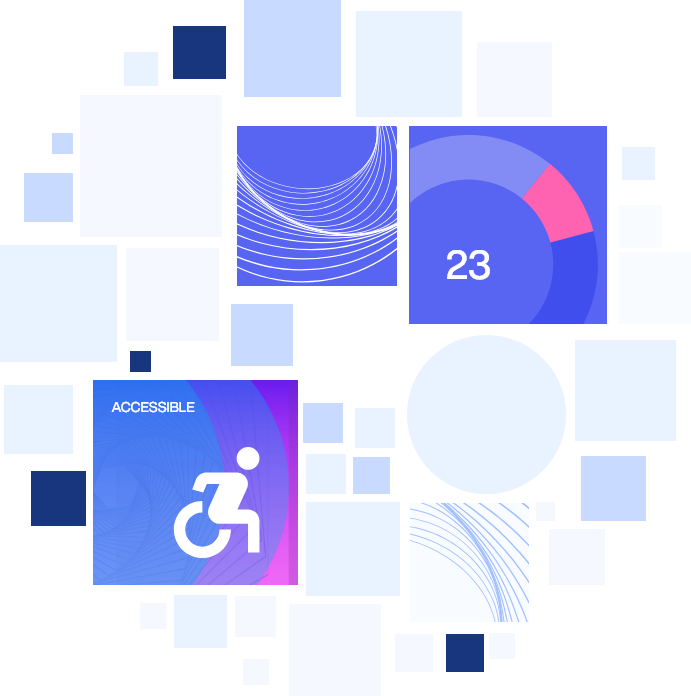
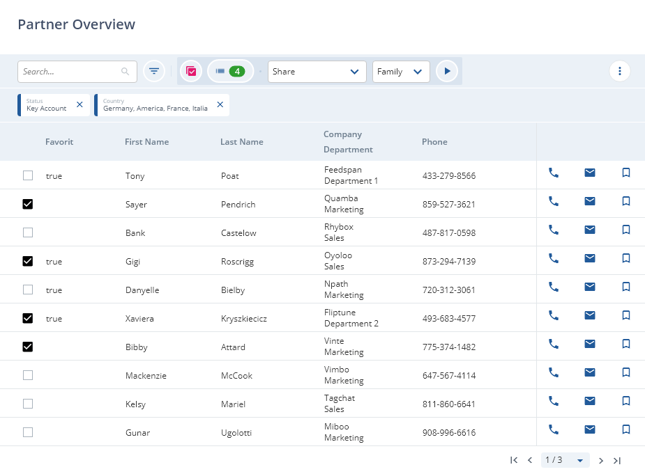
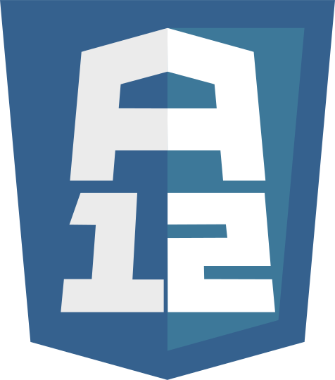

# Widgets Showcase

A12 Widgets

A12 Widgets is a comprehensive collection of prebuilt components designed to provide a pleasurable and accessible user experience.

EXPLORE WIDGETS

Curious What You Can Do With Our Widgets?

Using Widgets can help you to ship your features more quickly. From searching and sorting, to pagination and pinning, someone has probably already used Widgets to implement the functionality you're looking to add to your app.

TAKE A LOOK

News

10.02.2025

Interaction Hint

This widget is designed to assist users who navigate primarily with a keyboard, including those with movement disorders or cognitive challenges, ensuring that they can easily understand the purpose of each interactive element.

[*arrow\_forwardArrow Forward*Learn more](../Widgets.DataDisplay.InteractionHint/index.md)

10.02.2025

Resize Handler

The Resize Handler provides dynamic resizing capabilities, enabling users to adjust content area sizes with flexibility. This feature supports workspace personalization, helps prioritize specific content, and enhances usability based on user preferences or screen dimensions.

[*arrow\_forwardArrow Forward*Learn More](../Widgets.Layout.ResizeHandler/index.md)

")

09.10.2024

Supporting Panes Layout (SPL)

The generic layout is used to provide a consistent and flexible structure for UI Model Editors like the Content Model Editor and SME, enhanced user context, improves information accessibility, and supports the creation of complex, multi-level UI layouts through nesting and integration with other widgets.

[*arrow\_forwardArrow Forward*Learn More](../Experimental.SupportingPanesLayout/index.md)

09.10.2024

Interactive Tile

The Interactive Tile widget provides a button-like visual to present options in a familiar, interactive format, enhancing usability by making selections more intuitive and engaging, creating a better experience for users.

[*arrow\_forwardArrow Forward*Learn More](../Widgets.DataDisplay.InteractiveTile/index.md)

09.04.2024

Lexical based Rich Text Editor

The Rich Text Editor Widget is a highly performant and accessible text editor. It supports custom plugins, prebuilt nodes, and inherits common Text Field features like states, messages and helper text.

[*arrow\_forwardArrow Forward*Learn More](../Widgets.DataEntry.Editor.RichTextEditor/index.md)

About A12

A12 is mgm's award-winning Enterprise Low Code Platform. It helps companies and public authorities efficiently develop complex enterprise applications.

[Privacy Policy](https://www.mgm-tp.com/privacy-policy.html)[Imprint](https://www.mgm-tp.com/imprint.html)[About mgm](https://www.mgm-tp.com)