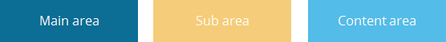
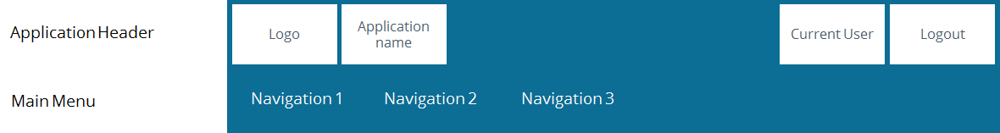
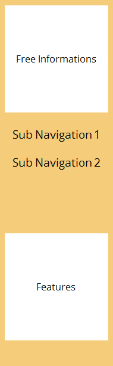
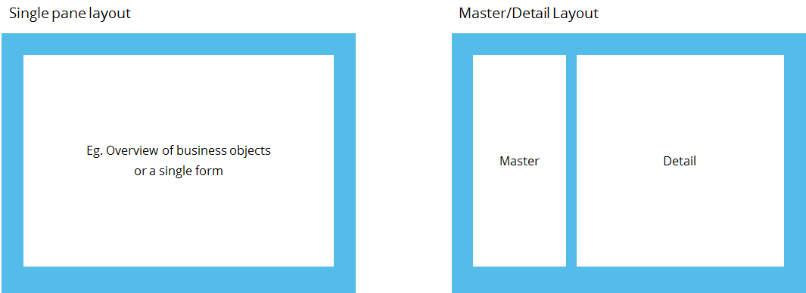

# Application Frame - Widgets Showcase

- Widgets

  /
- Layout

  /
- Application frame

*link*Application Frame

Overall structure

The core idea of the plasma design concept is that we call the **Application Frame**. This template is device independent and consists of:



Main Area

The main area consists of:



1. **Application Header**
   - The application header provides up to 4 slots for different information. In case the application needs/have more application wide information we allow the possibility of grouping information for example by the usage of a pop up menu.
2. **Main Menu**
   - We recommend to only use up to 7 navigation points for the first level.
   - We don't recommend more than 3 navigation levels. For a higher complexity we recommend the usage of the sub navigation placed in the sub area.
   - This menu should only be used for domain-level navigation hierarchies. Eg. categories like pants, shirts but NOT red pants, blue pants etc. For those we recommend the usage of the sub navigation placed in the sub area.

Sub Area

The sub area is optional and can consist of:



1. **Free information**
   - E.g. information like author of the document, weather etc.
2. **Sub navigation**
   - This should be used for a complex sub navigation.
   - Recommended depth of max. 4 levels.
   - For less complicated sub navigation we recommend using the tab navigation within our contentbox.
   - Each navigation point can lead to a different layout used in the content area.
3. **Features like**
   - Application wide actions, chats etc. are imaginable.
4. **Context specific actions**
   - Based on the content.

Content Area

The content area consists of layouts fulfilling different requirements. Right now we are supporting 2 layouts out of the box.



1. Single box
2. Master Detail

Each white panel shown here is represented as a contentbox.

Code Example

Here's how to implement a basic Application Frame:

```
1import { ApplicationFrame } from "@com.mgmtp.a12.widgets/widgets-core";
2import { ContentBox } from "@com.mgmtp.a12.widgets/widgets-core";
3
4const MyApplication = () => {
5  return (
6    <ApplicationFrame
7      header={
8        <ApplicationHeader
9          slots={{
10            left: <Logo />,
11            center: <SearchBar />,
12            right: <UserMenu />
13          }}
14        />
15      }
16      mainMenu={
17        <SlidingMenu
18          items={[
19            { label: "Dashboard", href: "/dashboard" },
20            { label: "Products", href: "/products" },
21            { label: "Orders", href: "/orders" }
22          ]}
23        />
24      }
25      sub={<SubNavigation />}
26      content={
27        <ContentBox>
28          <YourMainContent />
29        </ContentBox>
30      }
31    />
32  );
33};content_copy
```

For responsive behavior and sidebar options:

```
1<ApplicationFrame
2  responsive
3  sidebarConfig={{
4    expandedSubState: true,
5    subResizableOptions: {
6      minWidth: 200,
7      maxWidth: 400
8    }
9  }}
10  // ...other props
11/>content_copy
```

*code**bug\_report*

*link*API

**Note:**

- `prop*` is required.
- `prop` is deprecated.

ApplicationFrameProps.ToggleSidebarButtonProps

Property

Type

Description

`icon*`

`ReactNode`

Icon of the Toggle Sidebar Button

`smallView*`

`boolean`

Specifies whether the view is small or not.

`subExpanded`

`boolean`

Specifies whether the sub area of ApplicationFrame is expanded or collapsed.

`wrapperRef`

`RefCallback<HTMLElement>`

The reference of the element wrapping the main content if one exists.

`onClick`

`void`

A callback will be triggered when the button is clicked.

ApplicationFrameProps

Property

Type

Description

`className`

`string`

Additional css class names.

`closeSubOnClickOutside`

`boolean`

Click on anywhere outside the sidebar or use tab-out to close it.
Does not work when `disableCollapsingSub` is true.

**@default** `true` on tablet. `false` for the other device types.

`content*`

`ReactNode | StyledSlot`

This area is as seen in the screens.
On mobile, it is just overlapped by the sub area if the sub area is open.

`contentToolbar`

`ReactNode`

Toolbar to be placed on top of the content area

`disableCollapsingSub`

`boolean`

Disables collapsing for desktop devices. Doesn't influence mobile and tablet behavior.

`footer`

`ReactNode | StyledSlot`

The footer of ApplicationFrame

`htmlAttributes`

`{ contentAttributes: HTMLAttributes<HTMLDivElement>, footerAttributes: HTMLAttributes<HTMLDivElement>, headerAttributes: HTMLAttributes<HTMLDivElement>, mainContainerAttributes: HTMLAttributes<HTMLDivElement> }`

Additional props that will be placed at the original header, content, main container (the div inside the content), and footer element.
They should be used in case:

- Users want access to the native DOM properties of the elements but there's no property allows to do that.
  For instance, `htmlAttributes={{ contentAttributes: { "aria-hidden": true}; footerAttributes: { "aria-hidden": true} }}` .
- Users want to customize the attribute's value that is already defined in the elements.
  For instance, `htmlAttributes={{ mainContainerAttributes: { role: undefined } }}` .

`id`

`string`

Specifies an id that is used for html id attribute.

See [MDN*open\_in\_new*](https://developer.mozilla.org/en-US/docs/Web/HTML/Global_attributes/id "Leave Page")

`main*`

`ReactNode | StyledSlot`

This area will shrink due to the provided space of each device. It will always be 100% width.

`stickyFooter`

`boolean`

Specifies whether the footer should have a sticky style.

**@default** true

**Note:** It is not recommended to use in small viewports or on mobile devices, as it may take up a lot of spaces and negatively impact the user experience.

`style`

`CSSProperties`

Additional styles.

`sub`

`ReactNode | StyledSlot`

**Desktop:** This area is placed on the left and can be collapsed or expanded. When expanded the content area will shrink.

**Tablet:** In this case the sub area will partially overlap the content area.

**Smartphone:** 100% width but will be hidden initially and can be invoked by a button (place an example button somewhere).

`subExpanded`

`boolean`

Specifies whether the sub area of ApplicationFrame is expanded or collapsed.

`subExpandedState`

`"minimized" | "maximized"`

Specifies states of the expanded sub area. It can be minimized or maximized.

`subResizableOptions`

`boolean | ResizeOptions`

Specifies the options for resizing the boundary between the sidebar and the main content.

When set to `true` , the user can resize the boundary with default settings.
If an object of type `ResizeOptions` is provided, it allows for customized resizing options.

**Recommendation:** Instead of passing `true` , use an object of type `ResizeOptions` to specify `minWidth` and `maxWidth` .
This approach offers more precise control over the resize behavior, enhancing consistency and preventing extreme resizing that could impact the layout.

`subToolbar`

`ReactNode`

Toolbar to be placed on top of the sub area

`useToggleButton`

`boolean`

A toggle button will display at the right-bottom of screen and can be used to toggle the sidebar.

**@default** false

**Note:** This button will be applied for the small screen (<= 767px) and only be shown when the `sub` is provided.

`wrapperRef`

`RefCallback<HTMLDivElement>`

The reference of the element wrapping the main content if one exists.

`onExpansionChange`

`(subExpanded?: boolean) => void`

A callback to handle expansion event.

StyledSlot

Property

Type

Description

`content*`

`ReactNode`

Content of the styled slot.

`style*`

`CSSProperties`

Additional css classes for content element.

*link*Theming configuration

The following theme variables can be used to customize the component:

```
1"applicationFrame": {
2    "background": "#f7fafc",
3    "content": {
4        "position": "relative"
5    },
6    "header": {
7        "boxShadow": "none",
8        "minHeight": "48px"
9    },
10    "sidebar": {
11        "background": "#f6fafe",
12        "boxShadow": "none",
13        "containerBackground": "#f6fafe",
14        "containerBorderRight": "none",
15        "expandedMinimizedMinWidth": "378px",
16        "expandedMinimizedWidth": "30%",
17        "expandedWidth": "212px",
18        "paddingBottom": "48px",
19        "scrollableWidth": "68.8px",
20        "transition": "0.3s",
21        "width": "52px"
22    },
23    "mainContainer": {
24        "fontSize": "1rem",
25        "padding": "4px 4px"
26    },
27    "trigger": {
28        "background": "transparent",
29        "color": "#00589f",
30        "fontSize": "2.5rem",
31        "height": "52px",
32        "iconPadding": "4px 4px",
33        "mobile": {
34            "background": "#00589f",
35            "bottom": "24px",
36            "boxShadow": "0 1px 2px 0 rgba(22,25,29,0.4)",
37            "color": "#fff",
38            "right": "16px",
39            "size": "48px",
40            "collapsedFontSize": "1.75rem",
41            "interaction": {
42                "active": {
43                    "background": "#fff",
44                    "border": "2px solid #00589f",
45                    "borderColor": "#00589f",
46                    "color": "#00589f"
47                },
48                "focus": {
49                    "background": "#fff",
50                    "border": "2px solid #d50075",
51                    "borderColor": "#d50075",
52                    "color": "#d50075",
53                    "outline": "1px dotted #00589f"
54                }
55            }
56        },
57        "interaction": {
58            "active": {
59                "background": "transparent",
60                "border": "2px solid #00589f",
61                "borderColor": "#00589f",
62                "color": "#00589f"
63            },
64            "focus": {
65                "background": "transparent",
66                "border": "2px solid #d50075",
67                "borderColor": "#d50075",
68                "color": "#d50075",
69                "outline": "1px dotted #00589f"
70            },
71            "hover": {
72                "background": "transparent",
73                "border": "2px solid #00589f",
74                "borderColor": "#00589f",
75                "color": "#00589f"
76            }
77        }
78    },
79    "backgroundColor": "#f7fafc"
80}
```
*content\_copy*